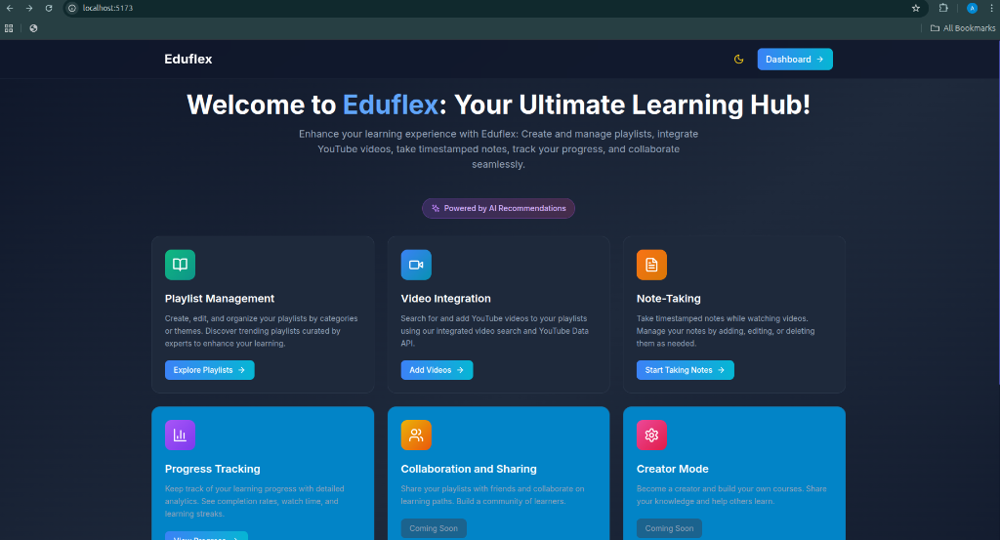
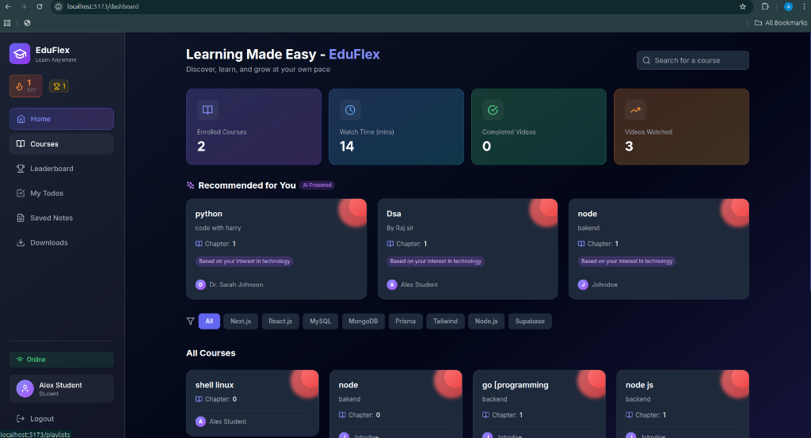
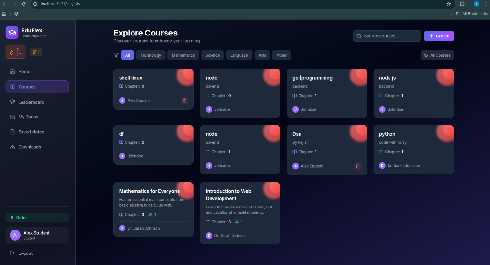
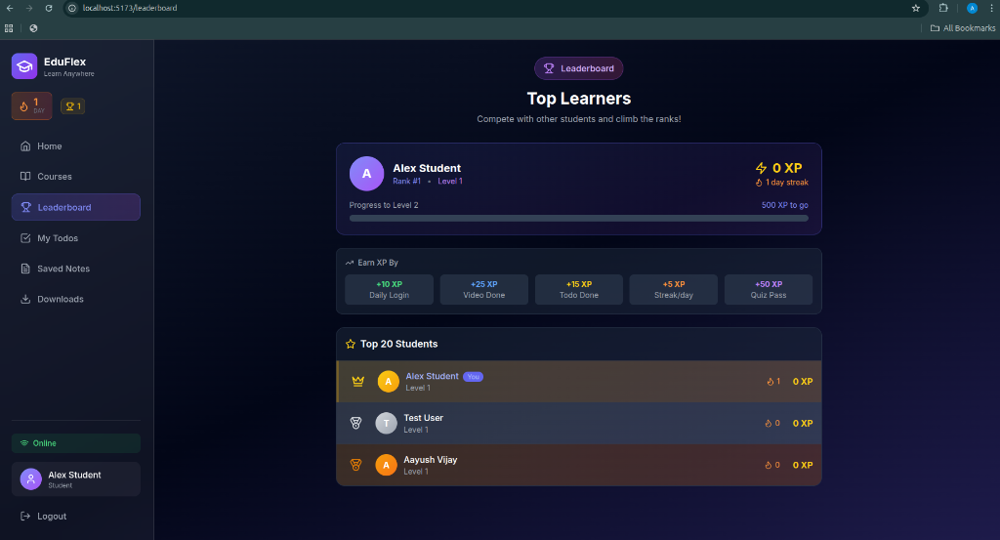
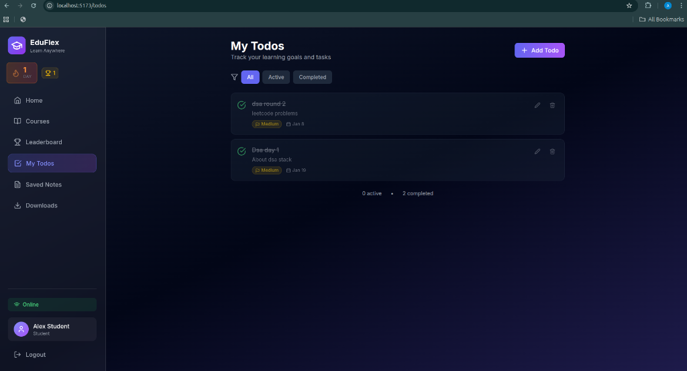

# EduFlex Lite

An offline-first Learning Management System built for low-bandwidth regions (SDG-4: Quality Education).

## Features

- 📚 **Course Management** - Create and manage educational playlists
- 🎥 **Video Player** - Watch videos with progress tracking
- 📝 **Notes** - Take and save notes while learning
- ✅ **Todos** - Manage your study tasks
- 🔥 **Streak Tracking** - Daily activity tracking
- 🏆 **Leaderboard** - Compete with other students
- 📴 **Offline Support** - Works without internet

## Screenshots

### Landing Page


### Dashboard


### Courses


### Leaderboard


### My Todos


## Tech Stack

- **Frontend:** React, Vite, TailwindCSS
- **Backend:** Node.js, Express, MongoDB
- **Auth:** JWT

## Project Structure

```
EduFlex-Lite/
├── client/          # React frontend
│   ├── src/
│   └── package.json
├── server/          # Express backend
│   ├── src/
│   └── package.json
└── README.md
```

## Setup

### 1. Clone the repo
```bash
git clone https://github.com/YOUR_USERNAME/EduFlex-Lite.git
cd EduFlex-Lite
```

### 2. Install dependencies
```bash
# Backend
cd server && npm install

# Frontend
cd ../client && npm install
```

### 3. Environment Variables

**Server (.env):**
```
MONGO_URI=your_mongodb_uri
JWT_SECRET=your_secret
PORT=5000
NODE_ENV=development
```

**Client (.env):**
```
VITE_API_URL=http://localhost:5000/api
```

### 4. Run locally
```bash
# Terminal 1 - Backend
cd server && npm run dev

# Terminal 2 - Frontend
cd client && npm run dev
```

## Deployment

- **Frontend:** Deploy `client/` to Vercel
- **Backend:** Deploy `server/` to Render

## License

MIT
